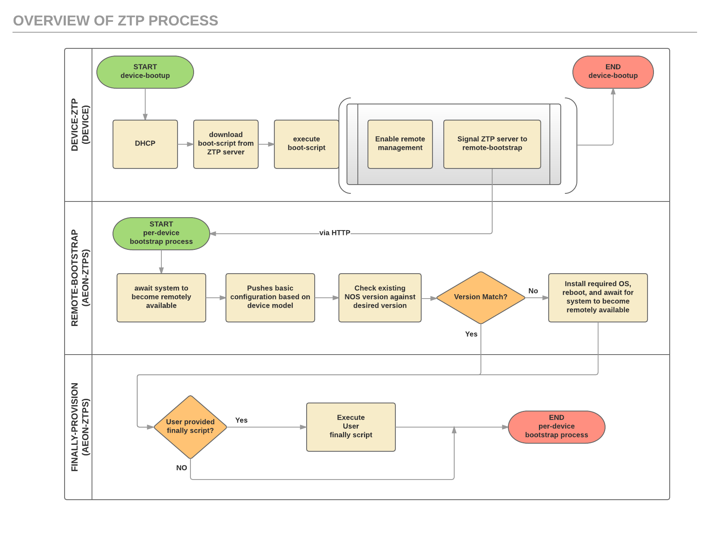

Getting Started Guide
=====================

This document provides all of the instructions to help you get started setting up your Aeon-ZTP server to operate
in your environment.  A setup `checklist`_ is provided in this document to assist in this process.

.. contents::
   :local:

General Overview
----------------

The purpose of the Aeon-ZTP framework is to provide a "universal" approach to bootstrapping your network devices and deploying them into your known good state.  While each vendor/NOS has a unique and specific mechanism for doing a ZTP process, they are different enough to make it very difficult for a network team to handle a multi-vendor network.  Aeon-ZTP takes the following approach - In the context of the initial on-box NOS bootup process do the minimal setup to enable remote management, and defer all of the complex bootstrapping to be done by the Aeon-ZTP server once a remote-connection back to the device is established.

This approach leads to a three-stage design:

      **Device-ZTP**: Begins execution on the device when the device boot-ups for the first time and starts the device
      specific ZTP process.  A ZTP bootscript is downloaded and executed on the device.  This script will configure the
      device for remote management by Aeon-ZTP, and signals Aeon-ZTP to start remote-bootstrapping.  As part of the
      device-ZTP process, the device may or may not automatically reboot.

      **Remote-Bootstrap**:  Aeon-ZTP runs a per-device background process to remotely bootstrap the device.  This
      process allows you to identify the specific NOS version that the device must run - and install it if it is not
      running it.  Additionally this process allows you to push basic / static configuration based on the device model.
      At the conclusion of this stage, the device is considered to be in an initial "known good state" per your
      intent of NOS version and basic configuration.

      **Finally-Provision**:  Aeon-ZTP optionally runs a finally script that allows you to perform any further
      configuration and or installation process.  The Aeon-ZTP framework is designed such that you can have different
      finally scripts for different group-policy and NOS environments.

An illustration of these stages:

.. _checklist:

Aeon-ZTPS Setup Checklist
-------------------------

.. |box|   unicode:: ☐ .. box

This section provides you a task checklist that you need to complete before using the Aeon-ZTP system.
Each of these tasks are further explain later in the document, as referred to by the section reference link

    |box|
        Copy your vendor NOS image file(s) into the :literal:`vendor_images` subdirectory.
        See section `Vendor Image Files`_ for details.

    |box|
        Setup the Aeon-ZTP control files to indicate which version of NOS you want loaded.
        See section `Group-Policy ZTP`_ for details.

    |box|
            Setup the NOS+model specific basic configuration files you want Aeon-ZTP to automatically install.
            See `NOS Boot and Model-Specific Configurations`_ for details.

    |box|
            Copy your finally provisioner scripts into the :literal:`profiles` subdirectory.
            Any files used by this script should either be copied into the :literal:`downloads`
            directory or the :literal:`vendor_images` directory

Aeon-ZTP Directories and Files
------------------------------
The Aeon-ZTP files that you will need to understand are found under :literal:`/opt/aeonztps/`.  You will need to
setup contents in the following subdirectories.

    :literal:`vendor_images`
        Contain the vendor/NOS binary files, and any other files provided by the
        NOS vendor, e.g. rpms, debs, etc.  You will need to place these files onto
        the Aeon-ZTPs

    :literal:`downloads`
        Contains files that you want to download as part of your "finally"
        script processing.  You would put anything you want to download that
        is not from your vendor/NOS here

    :literal:`etc\\profiles`
        Contains the group-policy definitions.  Currently only *default* is implemented.  Future versions of
        Aeon-ZTPS will support multiple group-policy definitions.

    :literal:`etc\\configs`
        Contains the group-policy NOS configuration files.

The following directories exist within the Aeon-ZTPS framework, but you should not need to make modifications:

    :literal:`webapp`
        Contains the actual Aeon-ZTP web application.
    :literal:`bin`
        Contains programs that are used by the Aeon-ZTP framework
    :literal:`run`
        Contains runtime files created / managed by the Aeon-ZTP framework.  For example the database that stores
        state information
    :literal:`tftpboot`
        Contains files that need to be provided to the devices via TFTP

Finally, if you have setup the Aeon-ZTPS to also provide DHCP service, the ISC-DHCP-Server is used.  The
configuraiton file is located in :literal:`/etc/dhcp/dhcpd.conf`

NOS Boot and Model-Specific Configurations
------------------------------------------
*Stages: Device-ZTP, Remote-Bootstrap*

The directory :literal:`/opt/aeonztps/etc/configs/<NOS>` contains the specific vendor NOS files used by the
Aeon-ZTP framework.  The following is a tree listing of files:

.. code:: bash

    admin@aeon-ztps:/opt/aeonztps/etc/configs$ tree
    .
    ├── eos
    │   ├── all.conf
    │   └── eos-boot.conf
    └── nxos
        ├── all.conf
        ├── N3K-C3164PQ.conf
        ├── N3K-C3164Q-40GE.conf
        ├── N9K-C9332PQ.conf
        ├── N9K-C9372PX.conf
        ├── N9K-C9396PX.conf
        ├── N9K-NXOSV.conf
        └── nxos-boot.conf

These files are installed on the device in two stages:

    :strong:`Device-ZTP`:  :literal:`<NOS>-boot.conf` file.  This file is loaded during the initial stage of the NOS ZTP
    process, i.e. when the device is executing it's ZTP mechanism.  The primary purpose is to enable remote management
    of the device for Aeon-ZTP remote-bootstrap processing.  For specific NOS details, refer to the specific NOS
    getting started guide, for example, :emphasis:`Arista EOS Setup Guide`.

    :strong:`Remote-Bootstrap`:  All other files are loaded when the Aeon-ZTP makes a remote connection back to the
    device.  The Aeon-ZTP framework will push two configuration files, the first all.conf, and the second is
    :literal:`<hw-model>.conf`.

You can modify any of these files, as well as create additional model specific files.  Again, refer to the specific
NOS getting started guide for any specific requirements / limitation details.

Vendor Image Files
------------------
:emphasis:`Stages: Remote-Bootstrap`

The :literal:`/opt/aeonztps/vendor_images/<NOS>` directory must contain the files you get from your NOS vendor
(e.g.Cisco, Arista, etc.).  For example, if you want to use the Arista EOS image "EOS-4.15.1F.swi" and you also plan
to use the EOS SDK, then your directory would look like:

.. code:: bash

    vendor_images/
    ├── eos
        └── EOS-4.15.1F.swi
        └── EosSdk-1.6.0-4.15.0F.i686.rpm

The mechanism to instruct Aeon-ZTP to load a specific version file is explained in the next section.

Group-Policy ZTP
----------------
:emphasis:`Stages: Remote-Bootstrap, Finally-Provision`

The directory :literal:`/opt/aeonztps/etc/profiles` contains a subdirectory for each policy group.  The purpose of the group-policy is to instruct the Aeon-ZTP
framework what to do on a per-NOS, per-model basis.

There are two basic instructions you can provide the framework:
    #.  Identify which NOS version needs to be installed on the device, and

    #.  Optionally provide a "finally" script that the framework will execute once the device is initially
        configured and has the correct OS running.

Each group-policy contains a subdirectory for each NOS supported.  The following is an example tree listing:

.. code:: bash

    admin@aeon-ztps:/opt/aeonztps/etc$ tree
    .
    └── profiles
        ├── cumulus
        │   ├── finally -> ../../../../bin/finally/aztp-finally-aos-cumulus.sh
        │   └── os-selector.cfg
        ├── eos
        │   ├── finally -> ../../../../bin/finally/aztp-finally-aos-eos.sh
        │   └── os-selector.cfg
        └── nxos
            ├── finally -> ../../../../bin/finally/aztp-finally-aos-nxos.sh
            └── os-selector.cfg

The file :literal:`os-selector.cfg` allows you to identify which version of NOS should be installed,
and which finally script should be run.
The following is an example for :literal:`/opt/aeonztps/etc/profiles/eos`:

.. code::  yaml

    #
    # 'default' means match hardware models not explicitly configured
    #
    default:
        exact_match: 4.15.1F
        image: EOS-4.15.1F.swi
        finally: finally

This :literal:`os-selector.cfg` file instructs the Aeon-ZTP to check the current OS version and match exactly to
"4.15.1F". If the device does not have this version, then Aeon-ZTPS should install the image "EOS-4.15.1F.swi".
This file would be located in the :literal:`/opt/aeonztps/vendor_images/eos` directory.

The finally script named "finally" would be run. Finally scripts can be created and placed into the relevant
vendor directory.

Regular expressions can also be used to match the NOS version. The following example would not perform a NOS
upgrade if either version 3.1.1 or 3.1.2 was installed on the device:

.. code::  yaml

    default:
        regex_match: 3\.1\.[12]
        image: CumulusLinux-3.1.2-amd64.bin

**Using Device Facts in OS-Selector**

The OS selector also supports matching based on any combination of hardware facts discovered during the ZTP process.
Multiple named groups can be created with a list of facts that all must match and an image file that must be installed.
The names of the groups is arbitrary and is not currently used for anything more than an organizational structure.

The following facts are supported to be used as a match criteria:
   - os_name
   - vendor
   - hw_part_number
   - hostname
   - fqdn
   - virtual (bool)
   - service_tag
   - os_version
   - hw_version
   - mac_address
   - serial_number
   - hw_model
   - ip_addr

Here is an example os-selector.cfg file:

.. code:: yaml

    # 'default' means match hardware models not explicitly configured
    default:
        exact_match: 3.1.2
        image: CumulusLinux-3.1.2-amd64.bin
        finally: finally

    # Group name is arbitrary and can be things like
    # 'rack-a', 'vendor-b', etc.
    Accton_Switches:

        # All keyword values here must match with the
        # device for it to be accepted into this group.
        matches:
            hw_model:
                - Accton_AS6712
            mac_address:
                - 0123456789012
                - 0123456789013
                - 0123456789014

        # Perform code upgrade if version does not
        # match this regex.
        regex_match: 3\.2\.[01]

        # If a fact match is made, and the NOS regex
        # does not match, this OS is installed.
        image: CumulusLinux-3.2.1-amd64.bin

        # Run finally script that is required for Accton_Switches group
        finally: accton_finally

    # This group will get Cumulus 2.5.7 installed
    Cumulus_2_Switches:

        matches:
            vendor:
                - CumulusVendor
            serial_number:
                - 1111111111
                - 2222222222

        regex_match: 2\.5\.[67]
        image: CumulusLinux-2.5.7-amd64.bin
