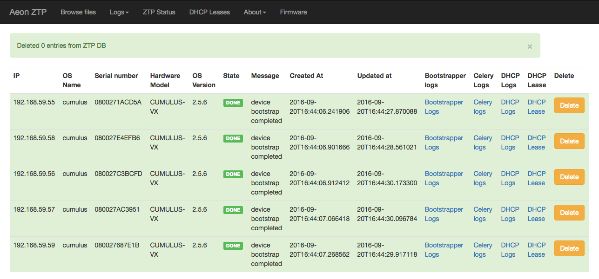
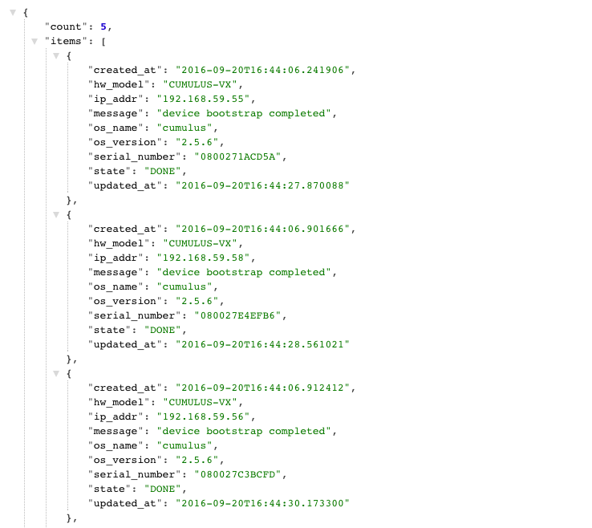

Operations Guide
================

The purpose of this document is to provide information on using the Aeon-ZTPS system once you have installed the
server and setup the system files necessary for each of the network OS you plan to use.  Information on those topics
are provided in other document pages.  Refer to the :doc:`Main Table of Conents <../index>` for a complete
listing.

.. contents::
   :local:

Once you've properly setup the Aeon-ZTPS for your environment, the primary :emphasis:`user-experience` is providing
visibility into the devices going through the ZTP process.  This document covers the information you'll need to know
when using the Aeon-ZTPS and any known :emphasis:`gotchas`.

Device Tracking Database
------------------------

    Aeon-ZTPS maintains a database of every device that is processed through the system.  The record key is the
    IP-address assigned by the DHCP server.

.. attention::

    If the Aeon-ZTPS sees a device attempt to register with an :strong:`existing` IP-address, even if it is the same
    device, the Aeon-ZTPS will not bootstrap that device.  If you have a scenario where you want to re-bootstrap a
    device, or re-use IP-addresses, then you :strong:`MUST` clear that IP-address from use.  Refer to
    `Maintenance Operations`_ for how to take this action.
..

    The following database fields are defined:

    * :strong:`ip_addr` - The device IP-address as assigned by the DHCP-server
    * :strong:`os_name` - The NOS name, as known by the Aeon-ZTPS system.
    * :strong:`os_version` - The NOS version string as provided by the device
    * :strong:`serial_number` - The device serial-number value as provided by the device
    * :strong:`hw_model` - The device hardware-model value as provided by the device
    * :strong:`state` -  The Aeon-ZTPS progress-state, as described in the section :ref:`below <progress_states>`
    * :strong:`message` - Additional information relating to the state value
    * :strong:`created_at` - Timestamp when the device was registered into Aeon-ZTPS
    * :strong:`updated_at` - Timestamp when this record was last updated

    You can view this information either via the :ref:`WebGUI <web_gui>` or the :ref:`REST/JSON API <rest_api>`, as
    described in the later sections in this document.

.. _progress_states:

Device Progress States
----------------------

    As Aeon-ZTPS is processing a device, the system will update the device record with the current :emphasis:`state`
    and status message.  The following is the list of defined device states and their meaning.  Understanding these
    states will help you undestand the progress and troubleshoot any issues.

    * :strong:`START`
        This state is set during the initial Device-ZTP stage when the ztp script registers the device with
        Aeon-ZTPS.

    * :strong:`DONE`
        This state indicates that the device has successfully completed the ZTP process.  This state is set
        after the :emphasis:`finally script` is executed, if you have provided one.

    * :strong:`CONFIG`:
        This state indicates that Aeon-ZTPS is pushing the static configuration files as part of the Remote-Bootstrap
        stage.

    * :strong:`AWAIT-ONLINE`:
        This state indicates that Aeon-ZTPS is waiting for the device to come back online and is reachable via the
        remote management mechanism; e.g. for Arista via eAPI.

    * :strong:`AWAIT-SYSTEM-READY`:
        Some network OS may become remotely reachable (AWAIT-ONLINE completed), but the NOS system management
        software is not yet ready.  For this type of NOS, e.g. NX-OS, this state indicates that Aeon-ZTPS is waiting
        for the NOS system management to become available.

    * :strong:`OS-INSTALL`:
        This state indicates that Aeon-ZTPS is in the process of installing a new version of the NOS.  The specific
        new version information is provided in the status field.

    * :strong:`OS-REBOOTING`:
        This state indicates that Aeon-ZTPS has initiated a device reboot, and the device is in the process of
        rebooting.

    * :strong:`FAILED`:
        This state indicates that the Aeon-ZTPS failed to properly process the device.  You will need to examine the
        :emphasis:`message` field for details.  You may also need to examine the logfiles for further details.

.. _web_gui:

The WebGUI
----------
You can access the WebGUI here: :literal:`http://<yourztps>:8080`.  At present there is no login/authentication
built into the WebGUI.  The following is a screen-shot of the "ZTP Status" dashboard page:

.. _rest_api:

REST/JSON API
-------------

The REST/JSON API URL is: :literal:`http://<yourztps>:8080/api`.  At present there is no login/authentication built
into the API.  The following is a screen-shot of displaying the JSON information about devices processed by Aeon-ZTPS:

There are a number of APIs available, which are fully described in a separate reference document.  Many of the APIs
are used by the Aeon-ZTPS bootstrap scripts; ie. not something you, the User, would have interest in.  The following
APIs would be of User interest, and they form the basis of providing information:

    * :literal:`GET /api/about` - get information about the Aeon-ZTPS system, e.g. version
    * :literal:`GET /api/devices` - retrieve device(s) status information
    * :literal:`DELETE /api/devices` - remove one or all device entries from the database

Log Files
---------
All of the AEON-ZTPS logs detailing the actual bootstrap process are sent to syslog in the following format:
.. code::

    Sep 21 19:07:13 aeon-ztps eos-bootstrap INFO 172.20.116.13: config completed OK.
    Sep 21 19:07:13 aeon-ztps eos-bootstrap INFO 172.20.116.13: Virtual device. No OS upgrade necessary.

The Aeon-ZTPS system maintains a number of logs in the directory: :literal:`/var/log/aeon-ztp`, as follows:

    * :literal:`worker1.log`
        This logfile used by the background scheduling system, celeryd.
        This file may be of interest as it shows you when NOS specific bootstrap scripts are launch for each device.

    * :literal:`nginx.access.log`
        This logifle is maintained by the Nginx system.  It may be of interest as it
        shows all of the HTTP commands executed on Aeon-ZTPS.

    * :literal:`nginx.error.log`
        This logifle is maintained by the Nginx system.  It may be of interest as it
        shows any errors experienced by the Nginx system.

Maintenance Operations
----------------------

    * :strong:`Flush the Entire Aeon-ZTPS device database`
        You can clear the Aeon-ZTPS devices database by using the following command at the Linux prompt:

        .. code-block:: shell

            user@host$ curl -X DELETE http://<aeonztps>:8080/api/devices?all=1
            {
              "message": "all records deleted",
              "ok": true
            }

    * :strong:`Delete Specific IP-Address from Aeon-ZTPS device database`
        You can remove a specific device from the database using the following command at the Linux prompt:

        .. code-block:: shell

            user@host$ curl -X DELETE http://<aeonztps>:8080/api/devices?ip_addr=192.168.59.54
            {
              "count": 1,
              "message": "1 records deleted",
              "ok": true
            }

..

    * :strong:`Flush the DHCP Leases`
        If your Aeon-ZTPS is also providing DHCP service, you can use the following command at the Linux prompt to
        clear the dhcpd.leases file and restart the DHCP service.

        .. code-block:: shell

            admin@aeon-ztps:~$ sudo dhcpd-reset
            + service isc-dhcp-server stop
            + rm -f /var/lib/dhcp/dhcpd.leases
            + service isc-dhcp-server start

